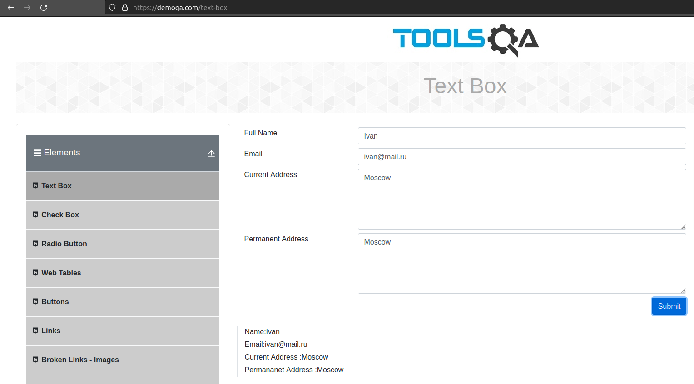
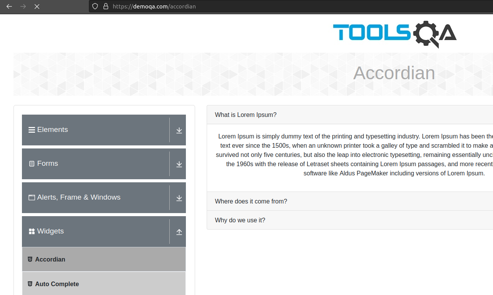
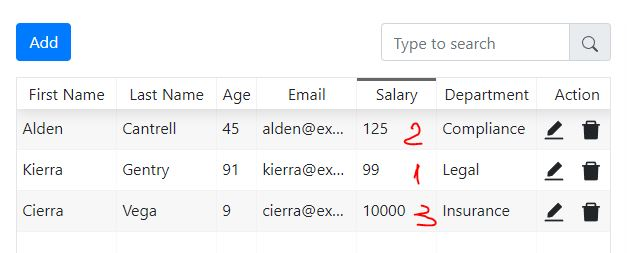

# Баг-репорт


Изменить владельца
```
sudo chown vit:vit webtable.jpg
```
Изменить права
```
chmod 664 webtable.jpg
```
### General

Разные регулярные выражения для проверки поля e-mail:
На странице [TextBox](https://demoqa.com/text-box) = ```^\w+([\.-]?\w+)*@\w+([\.-]?\w+)*(\.\w{2,3})+$```
На странице [Web Tables](https://demoqa.com/webtables) = ```^([a-zA-Z0-9_\-\.]+)@([a-zA-Z0-9_\-\.]+)\.([a-zA-Z]{2,5})$```

Оба варианта пропускают часть неверных e-mail например: user@_.comm, "user@..comm"  и не пропускают правильные, например с ip-адресом или с доменом .moscow

### Elements
**[Text Box](https://demoqa.com/text-box)**

В результирующем тексте неправильно расставлены пробелы вокруг двоеточия


### Widgets

**[Accordian](https://demoqa.com/accordian)**

Oшибка в слове Accordian (правильно - Accordion)


### Elements - Web Table

Сортировка в поле Salary работает как со строками, а должна как с числами


